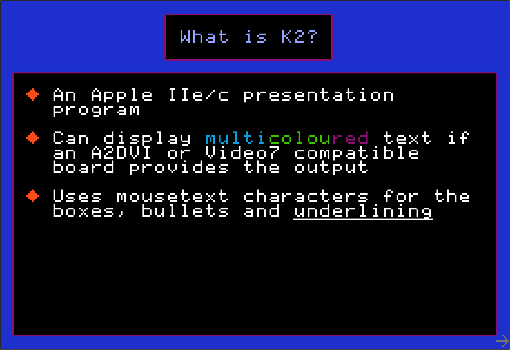
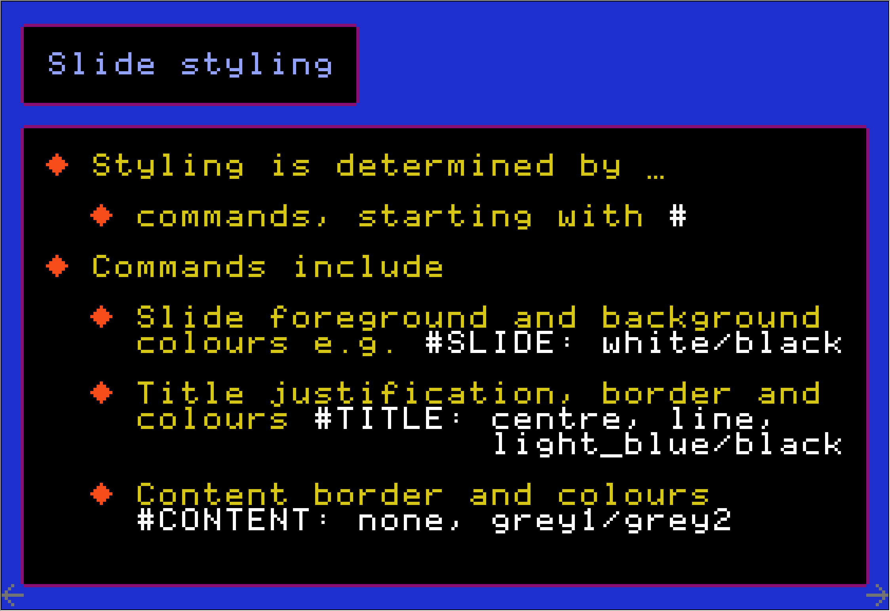
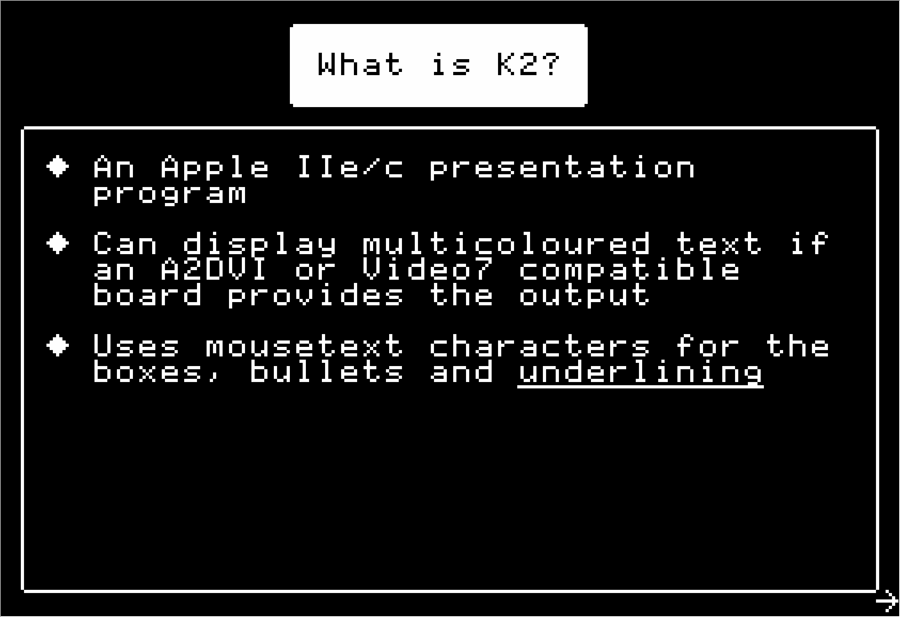

K2 an Apple IIe/c Presentation Program
======================================
K2 can be used to give presentations or talks using slides containing optional titles and points. The Apple II 40 column text screen with mousetext characters are used for the display.

The slides are contained in a single text file. The format of the text file is described below.

What makes K2 unique is that it uses the coloured text screen made available on many Video7 RGB cards and their compatibles. This includes the A2DVI cards which have been around since 2024 and also the AppleWin emulator when in RGB card/monitor mode. See the [github page](https://github.com/ThorstenBr/A2DVI-Firmware) for the A2DVI firmware which provides this feature.

Images are from the AppleWin emulator.

Installing K2
-------------
K2 is written in [David Schmenk's PLASMA](https://github.com/dschmenk/PLASMA), which is the greatest thing to have happened to Apple II software development in the last 20 years. K2 has not been optimised, and parts could be rewritten in assembly to make the slide presentation faster. It works adequately at 1MHz but if you have an accelerator or emulator running faster than that I would recommend it.

You can install PLASMA and compile the source in that environment if you desire.

Alternatively there is a disk image file K2.po contained in this repository with the program files and the example [aboutk2](aboutk2) slideshow. This includes a recent version of a minimal PLASMA distribution to run K2.

How to use K2
-------------
1. Prepare the slide file. Use any Apple II program which can save a text file.
2. At the command prompt type `+k2 slideFilename`
3. Move through the slides with the **spacebar** or right arrow key.
4. Move backwards through the slides with the left arrow key.
5. Type "Q" to quit.

The slides show arrows at bottom right and left hand corners indicating if there are next or previous slides.

Text slide files
----------------
A K2 slide file is vaguely WYSIWYG (in a similar way to Markdown).

e.g. The source of the slide in the image above is:

    #-----------------------------------
    
     What is K2?
    
    #-----------------------------------
    
    + An Apple IIe/c presentation
      program
    
    + Can display *{MEDIUM_BLUE}multi**{GREEN}colou**{MAGENTA}red* text if
      an A2DVI or Video7 compatible
      board provides the output
    
    + Uses mousetext characters for the
      boxes, bullets and _underlining_

The best way to understand the source format is by looking at [aboutk2](aboutk2).

List of Commands and Values
---------------------------
Command lines are prefixed with a `#` as _the first character in the line_.
The currently available commands are:

    #SLIDE:, #TITLE:, #-, #CONTENT:, #BULLET:

`#SLIDE:` is the whole slide command and is followed by a foreground and a background colour separated by a `/`; e.g. `white/purple`. This sets the foreground and background colours for all slides following this command. Slide colours usually only apply to the edges of the slide outside of any title and content areas. In particular this sets the colour of any mousetext boxes surrounding titles and contents.

`#TITLE:` is the title command and can be followed by values in this order - justification, outline, colours. Justification is one of `left`, `centre` or `right` and indicates the placement of the title across the screen. Outline is either `line` or `none` and indicates whether the title should be surrounded by a mousetext outlined box or not. Colours are the foreground/background colours as in the `#SLIDE:` command, but these colours apply to the title area.

The `#TITLE:` values stay in effect for all following titles until changed later in the source file.

`#-` indicates the title area of a slide, everything after this on the same line is ignored. The next line starting with `#-` shows the end of the title area.

Slide titles consist of **one line of text** but the box surrounding the title can contain any number of lines. The number of lines between matching `#-` commands is the number of lines K2 will include inside the title area. If there are additional lines of text between the `#-` commands those lines are ignored but do count towards the number of lines inside the text area.

K2 counts the number of spaces on the line before the title text and duplicates this following the title text. e.g. If the title line is "  Hi there" with two spaces before the "H" then the displayed title inside the title area will be surrounded by two spaces on the left and two spaces on the right. This is because the PLASMA +ed editor is the easiest way to prepare K2 slides and it does not save spaces at the right end of lines.

`#CONTENT:` is the content command and accepts outline and colour values as in `#TITLE:`. This determines whether the content area will be inside a mousetext box or not and what foreground and background colours to use inside the content area. Like other commands it stays active until changed later in the source.

`#BULLET:` is the bullet command and is followed by the name of the character to use as a bullet and the bullet's colour. Bullets are included in the content area whereever a `+` character appears.

  * the `+` and any other character can be escaped to see it in the usual way  `\+` .

Bullet character names are: `diamond`, `cross`, `openapple`, `closedapple`, `checkmark`, `ellipsis`, `hyphen` and `arrow`.

Formatting in the Content area
------------------------------
The content area can have additional formatting which applies to runs of text.

  * Underlining
    * an area can be underlined using the `_` character at the start and end of the underlined text. This only works if the following line in the content area is empty because it uses a mousetext character.

  * Different colours
    * The content text has a foreground colour determined by the `#CONTENT:` command, but this can be overridden over a string sequence by preceding the string with a colour value between `*{` and `}` as in `the word *{ORANGE}blue* will display in orange`. The colour applies until a terminating `*` or the end of the line.

  * Automatic substitutions
    * Three dots `...` in the content area gets turned into the ellipsis character.

Next slide
----------
Slides start with title areas. Title areas can be empty in which case the slide only shows a content area. Any use of a `#` command ends the current slide.

Works in monochrome
-------------------
If you don't have the means to see the coloured text, as shown above, the program still works and shows titles in inverse characters. It is not as pretty but it works and displays the mousetext characters and underlining.

Why K2?
-------
I have always used Keynote for presentations on Macs and I thought it would be appropriate to have a simple presentation program for my Apple II machines. Hence the name.